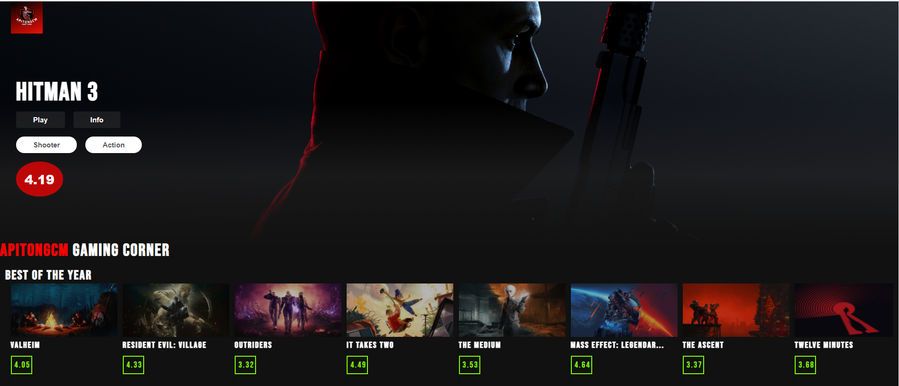

# Getting Started with Create React App
 <h1>APITONGCM GAME CORNER<h1>
# This is for educational purposes only I do not claim the images, trailers and information that are given in the website.

<img src = "./mobile-game-corner.jpg"

#How to open the project:
In the project directory, you can run:

### `npm start`

Runs the app in the development mode.\
Open [http://localhost:3000](http://localhost:3000) to view it in the browser.

###DEPENDENCIES used in the project:
You can see the dependencies and the version used in package.json file. 

##API
You can check https://rawg.io/ for the API I used. 

## react-youtube 
## axios
## This project is for people looking for a new game or high rated games. 
This website will provide you the ratings and the top & popular games in the market. 
This games are available in cross platforms (pc, switch, playstation, android, and etc.)

The main purpose of creating this project is to familiarize with the basics of REACT. 
Also for practicing in fetching api using Axios. 